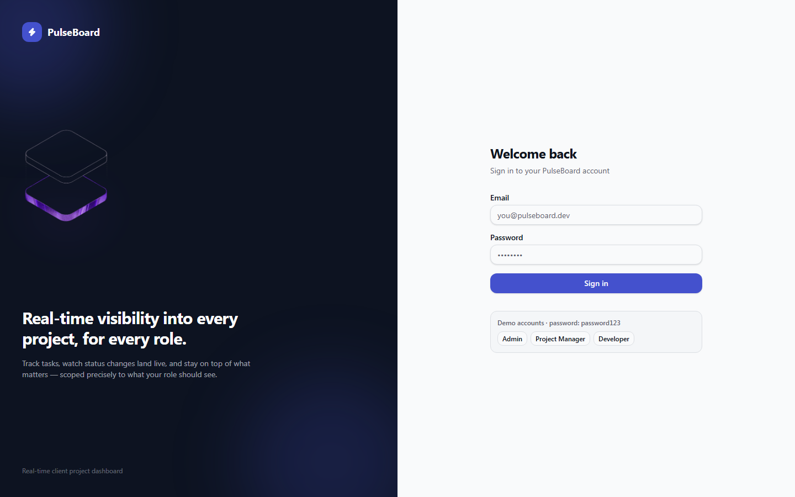
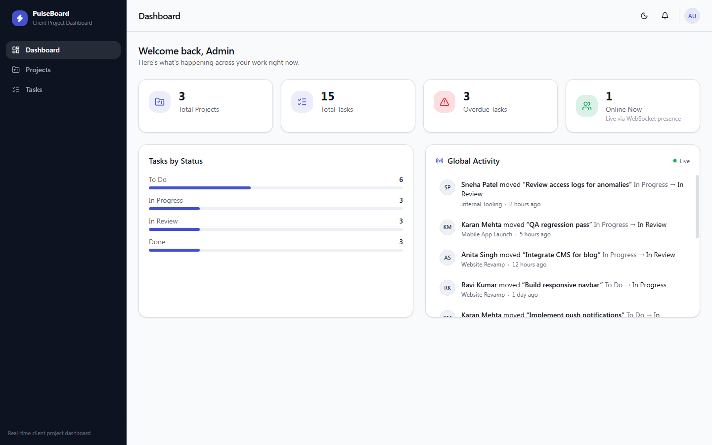
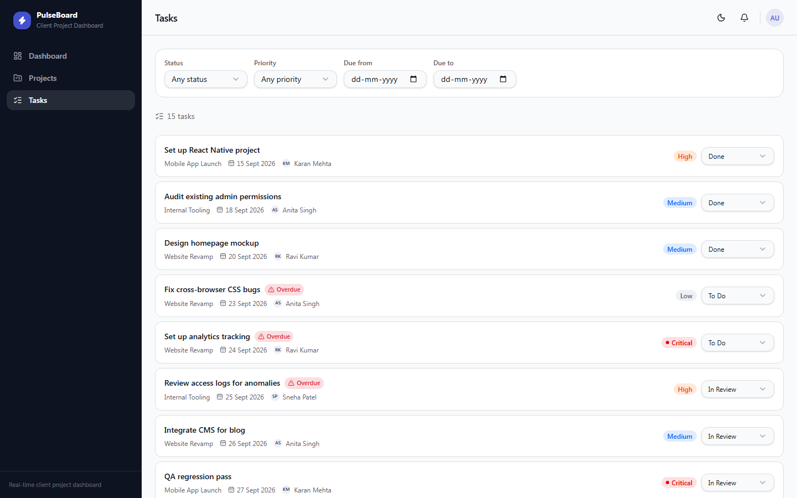
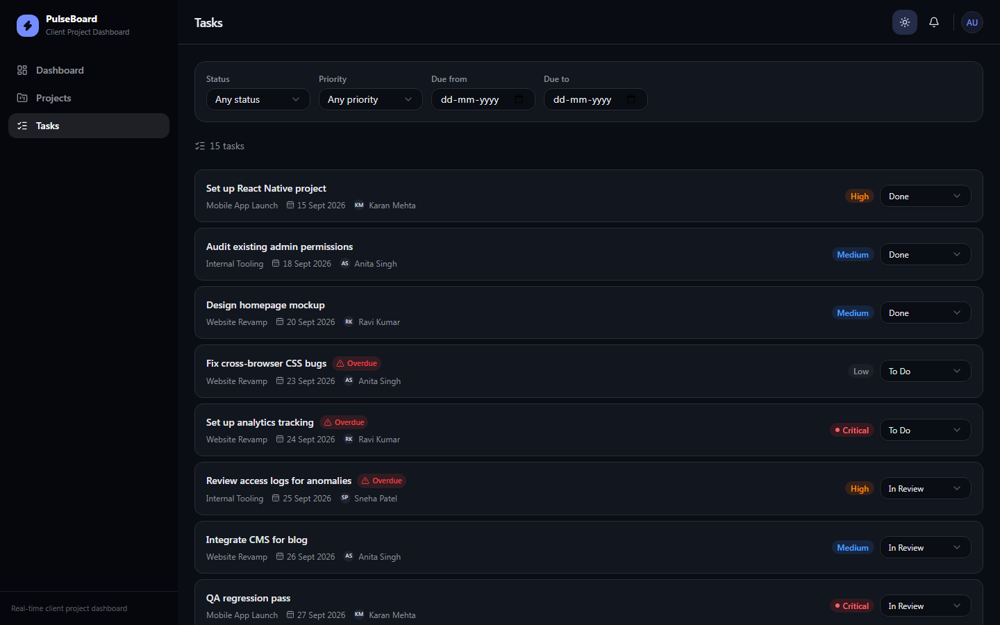

# PulseBoard

A real-time client project dashboard with role-based access control (Admin / Project Manager / Developer) and a live, role-filtered activity feed — built as a full-stack showcase of JWT auth with rotation, defense-in-depth authorization, and WebSocket-driven state.

**Status:** Backend and frontend complete and verified end-to-end.

## Screenshots

| | |
|---|---|
|  |  |
| Login | Admin dashboard — live stats, presence count, global activity feed |
|  |  |
| Filterable task list, shareable via URL query params | Full dark mode support |

## Repository Structure

```
backend/    Node.js + Express + TypeScript API
frontend/   React + TypeScript client (Vite, Tailwind, shadcn/ui)
```

The two are independent projects — separate `package.json`, separate dependency trees, run separately. There is no shared workspace tooling between them by design.

## Tech Stack

| Concern | Choice |
|---|---|
| Backend framework | Express 5 (TypeScript) |
| Frontend | React 19 + TypeScript, Vite, Tailwind CSS v4 |
| UI components | shadcn/ui (hand-assembled from Radix primitives) |
| Server state | TanStack Query |
| Database | PostgreSQL 16 (Docker) |
| ORM | Prisma ORM 7, with the `@prisma/adapter-pg` driver adapter |
| Real-time | Socket.io (server and client) |
| Background jobs | Bull, backed by Redis |
| Validation | Zod (server-side, on every write endpoint) |
| Auth | JWT access + refresh tokens; refresh token in an HttpOnly cookie, tracked/revocable in the database |

## Local Setup

Prerequisites: Node.js 20+, Docker Desktop.

### Backend

```powershell
cd backend
npm install
cp .env.example .env
```

Generate real secrets for the two JWT variables in `.env` (don't ship the placeholder values):

```powershell
node -e "console.log(require('crypto').randomBytes(48).toString('hex'))"
```

Run it twice and paste one result into each of `JWT_ACCESS_SECRET` / `JWT_REFRESH_SECRET`.

Start Postgres and Redis:

```powershell
docker compose up -d
```

Apply migrations and generate the Prisma client (the client also regenerates automatically after `npm install` via a `postinstall` hook):

```powershell
npx prisma migrate deploy
```

Seed the database (1 Admin, 2 PMs, 4 Developers, 3 projects with 5 tasks each, 2 overdue tasks, pre-existing activity log and notification entries):

```powershell
npx prisma db seed
```

Start the server:

```powershell
npm run dev
```

The API is now running at `http://localhost:4000`.

### Frontend

```powershell
cd frontend
npm install
cp .env.example .env
npm run dev
```

The app is now running at `http://localhost:5173`. All seeded users share the password `password123`:

| Role | Email |
|---|---|
| Admin | admin@pulseboard.dev |
| PM | pm1@pulseboard.dev, pm2@pulseboard.dev |
| Developer | dev1@pulseboard.dev, dev2@pulseboard.dev, dev3@pulseboard.dev, dev4@pulseboard.dev |

The login page also has one-click buttons that fill these in for you.

## Database Schema

Enums: `Role` (ADMIN / PM / DEVELOPER), `TaskStatus` (TODO / IN_PROGRESS / IN_REVIEW / DONE), `TaskPriority` (LOW / MEDIUM / HIGH / CRITICAL), `NotificationType` (TASK_ASSIGNED / TASK_IN_REVIEW).

| Model | Purpose | Key relationships | Indexes and why |
|---|---|---|---|
| `User` | Account + role | Has many projects (as PM/Admin creator), tasks (as assignee), activity logs, notifications, refresh tokens | `email` unique (login lookups) |
| `RefreshToken` | Hashed, revocable refresh tokens | Belongs to `User` | `userId` — looked up on every refresh/logout |
| `Client` | The agency's clients | Has many `Project` | — |
| `Project` | A client engagement | Belongs to `Client` and to the `User` who created it (`createdById`) | `createdById` (every PM-scoped query filters on this), `clientId` |
| `Task` | Unit of work inside a project | Belongs to `Project`, optionally assigned to a `User` | `projectId`, `assignedToId`, `status`, `priority`, `dueDate` — these are exactly the columns every filter/dashboard query hits |
| `TaskActivityLog` | Immutable history of status changes | Belongs to `Task` and (denormalized) `Project`, records the `User` who made the change | `[projectId, createdAt]` for the project-scoped feed/catchup query, `taskId` |
| `Notification` | In-app notifications | Belongs to `User`, optionally references a `Task` | `[userId, isRead]` — the unread-count query runs on nearly every mutation |

All primary keys are UUIDs rather than auto-increment integers — non-sequential IDs mean a Developer can't probe adjacent task/project IDs to guess at data belonging to someone else, which matters for the role-isolation design below.

## Architectural Decisions

**Role-based access is enforced at two layers, not one.** Every protected route requires a valid JWT (`authenticate` middleware) and, where the whole route is role-restricted (e.g. only Admin/PM can create a project), a `requireRole(...)` middleware. But route-level role checks alone can't express "a PM may only see *their own* projects" or "a Developer may only update the status of tasks *assigned to them*" — so every read/write in the `projects`, `tasks`, `activity`, and `notifications` services additionally scopes its Prisma query (or performs an explicit ownership check) against `req.user`. A forged or role-modified JWT still only unlocks what that query-level check allows, regardless of which route was hit. The frontend mirrors these same rules purely for UI purposes (hiding buttons a role can't use) — it is never the actual access boundary.

**Socket.io over a native WebSocket.** The activity feed needs per-project and per-role broadcast targeting (Admin sees everything, a PM sees only their own projects, a Developer sees only their own assigned tasks) plus connection-count presence tracking and automatic reconnect handling. Socket.io's built-in room system maps directly onto this (`user:{id}`, `project:{id}`, and a single `global:activity` room for Admins) without hand-rolling connection bookkeeping, reconnect logic, or a rooms concept on top of raw `ws`.

**Bull + Redis for the overdue-task scheduler**, over `node-cron`. `node-cron` would work for a single always-on process, but Bull gives a persistent, inspectable job queue — the schedule survives a server restart, and the same Redis instance is already available since it's needed for horizontal scaling of Socket.io in a real deployment. In its current form it's one repeatable job (a 5-minute scan flagging tasks past due and not yet `DONE`), but the mechanism doesn't need to change if that grows.

**Token storage.** Access tokens (short-lived, 15 min) are returned in the response body and held in memory by the client — never persisted to `localStorage`, so they can't be read by an injected script via XSS. Refresh tokens (7 days) are set as an `HttpOnly`, `SameSite=Lax` cookie, never accessible to JavaScript at all. Refresh tokens are additionally hashed and stored in the database with an `expiresAt`/`revokedAt`, and every refresh **rotates** the token (the old one is revoked, a new one issued) — so a stolen refresh token is only useful until the legitimate user's next refresh, at which point the theft becomes detectable (the legitimate user's own refresh will fail). On the frontend, keeping the access token in memory means a full page reload loses it — this is handled by a bootstrap call to `/auth/refresh` (using the still-present cookie) on app mount, so a reload never actually logs the user out.

**Prisma 7 with a driver adapter.** Prisma 7 requires an explicit adapter (`@prisma/adapter-pg`) rather than the implicit connection earlier versions used — chosen over raw SQL so every query stays type-checked against the schema and there's no hand-written SQL scattered through the service layer.

**Zod for validation**, applied server-side on every write endpoint via a shared `validateBody`/`validateQuery` middleware — never trusting client-side validation alone. The frontend uses the same library (via `react-hook-form` + `@hookform/resolvers/zod`) for form validation, purely for UX — the server-side check is what actually matters.

**TanStack Query for all server state.** Every list, detail view, and mutation on the frontend goes through TanStack Query rather than ad-hoc `useEffect`/`useState` data fetching — it gives cache invalidation on mutation (e.g. creating a task automatically refreshes the task list and dashboard), request deduplication, and loading/error states for free. Live socket events (`activity:new`, `notifications:new`, etc.) invalidate the relevant query rather than maintaining a second, parallel copy of the same data — one source of truth per resource.

**shadcn/ui components built by hand, not via the CLI.** The interactive `shadcn` CLI needs a terminal prompt this environment couldn't provide, so every primitive (button, dialog, select, dropdown-menu, tabs, etc.) was assembled directly from its underlying Radix package and Tailwind classes, following the same conventions the CLI would generate. Functionally equivalent, fully owned code with no black-box dependency.

## Known Limitations

- If a PM creates a **new** project mid-session, their already-open socket connection won't automatically join that project's room until they reconnect (e.g. refresh the page). Acceptable at this scale, but would need an explicit re-join call on project creation for a production system.
- Online-presence tracking is held in an in-memory `Map` inside the Node process. This is correct for a single server instance but would need to move to a Redis-backed store to work correctly across multiple horizontally-scaled server instances.
- The Postgres container is mapped to host port **5433**, not the Postgres default of 5432 — this avoids a conflict with any pre-existing native PostgreSQL install on the development machine. `docker-compose.yml` and `.env.example` are already consistent with 5433, so this requires no action for a fresh setup.
- No automated test suite yet — the backend was verified via a full manual Postman regression pass through every role/endpoint combination, and the frontend via a scripted Playwright smoke pass, rather than CI-runnable tests.
- Notification unread counts are recomputed with a fresh DB query on every mutation rather than maintained as an in-memory counter — trades a small amount of query overhead for a guarantee the badge can never drift out of sync with the database.
- The sidebar navigation is hidden below the `md` breakpoint with no mobile drawer replacement yet — the app is fully usable on desktop/tablet widths, but small-screen navigation needs a follow-up.
- There's no dedicated task-detail page or a flow to edit an existing project's name/description/client after creation — task history is visible via the activity feed and task rows support inline status changes, but a few edit affordances are still missing.

## API Overview

| Method | Path | Notes |
|---|---|---|
| POST | `/auth/login`, `/auth/refresh`, `/auth/logout` | |
| GET | `/auth/me` | Restores the session's user info after a page reload |
| POST/GET | `/clients` | Admin/PM only |
| POST/GET | `/projects`, `/projects/:id` | Create is Admin/PM only; reads are role-scoped |
| POST | `/projects/:projectId/tasks` | Admin or the owning PM only |
| GET | `/tasks`, `/tasks/:id` | Role-scoped; supports `?status=&priority=&dueFrom=&dueTo=` |
| PATCH | `/tasks/:id` | Full edit — Admin/owning PM only |
| PATCH | `/tasks/:id/status` | Admin, owning PM, or the assigned Developer |
| GET | `/activity/feed` | Role-scoped, `?after=<timestamp>` for missed-event catchup |
| GET/PATCH | `/notifications`, `/notifications/:id/read`, `/notifications/read-all` | |
| GET | `/dashboard` | Response shape depends on the caller's role |
| GET | `/users` | Admin/PM only — populates assignee pickers |

Socket.io events: `activity:new`, `presence:update` (Admin only), `notifications:new`, `notifications:unreadCount`.
